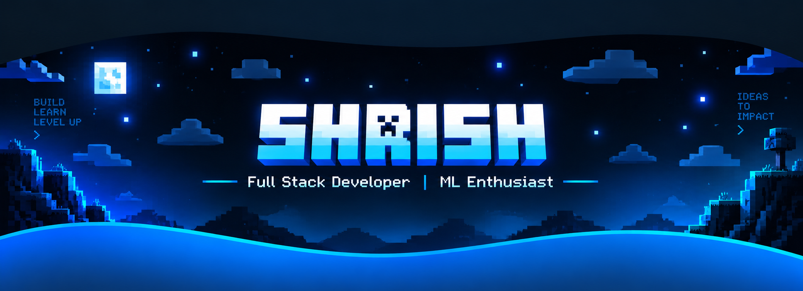

<!-- ─────────────────────────────────────────────────────────────────────────
     SHRISH MHASKE · GitHub Profile README
     Drop this file into the repo named exactly   shrish2406/shrish2406
     as   README.md   (a repo whose name equals your username).

     Every live card below was HTTP-tested and responds 200.
     Sections that need a one-time GitHub Action are marked in SETUP.md.
     ───────────────────────────────────────────────────────────────────────── -->

  

  

  

  

  

 

  

  

  

  

---
##  GitHub Analytics

   

 

  
   
  Current streak · longest streak · total contributions

 

  
   
  Contribution activity graph · updated daily

---##  Tech Stack

<b>Languages</b>

  
  
  
  
  
  

<b>Frontend</b>

  
  
  
  
  
  

<b>Backend & Databases</b>

  
  
  
  
  

<b>ML & Data Science</b>

  
  
  
  
  
  
  
  

<b>Tools & Platforms</b>

  
  
  
  
  
  
  
  

##  LeetCode & Problem Solving

  

  

  

  

  

  
    <b>DSA • PROBLEM SOLVING • COMPETITIVE PROGRAMMING</b>
  

<b>Thanks for stopping by — let's build something.</b>

  

  

  

  

  

  

  

  
    <b>CODE • CREATE • COLLABORATE</b>
  

 

  

